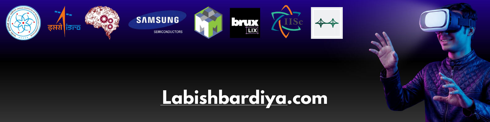

<!--
████████████████████████████████████████████████████████████████████████████████
  LABISH BARDIYA — GitHub Profile README
  github.com/labishbardiya
████████████████████████████████████████████████████████████████████████████████
-->

<!-- ═══════════════════════════════════════════════════════════════════════════ -->
<!--  LINKEDIN BANNER                                                           -->
<!-- ═══════════════════════════════════════════════════════════════════════════ -->
<a href="https://linkedin.com/in/labishbardiya" target="_blank">
  
</a>

<br/>
<br/>

<!-- ═══════════════════════════════════════════════════════════════════════════ -->
<!--  NAME — martonlederer style                                                -->
<!-- ═══════════════════════════════════════════════════════════════════════════ -->
<h1 align="center">
  Hi, I'm Labish Bardiya
  
</h1>

<!-- ═══════════════════════════════════════════════════════════════════════════ -->
<!--  TYPING TAGLINE — DenverCoder1/readme-typing-svg                          -->
<!-- ═══════════════════════════════════════════════════════════════════════════ -->
<p align="center">
  <a href="https://readme-typing-svg.demolab.com" target="_blank">
    
  </a>
</p>

<!-- ═══════════════════════════════════════════════════════════════════════════ -->
<!--  SOCIAL ICONS — DenverCoder1 style + shields.io                           -->
<!-- ═══════════════════════════════════════════════════════════════════════════ -->
<p align="center" target="_blank">
  <a href="https://linkedin.com/in/labishbardiya" target="_blank">
    
  </a>&nbsp;
  <a href="https://www.youtube.com/@LabishBardiya" target="_blank">
    
  </a>&nbsp;
  <a href="https://x.com/labishbardiya" target="_blank">
    
  </a>&nbsp;
  <a href="https://dev.to/labishbardiya" target="_blank">
    
  </a>&nbsp;
  <a href="https://substack.com/@labishbardiya7" target="_blank">
    
  </a>&nbsp;
  <a href="https://labishbardiya.com" target="_blank">
    
  </a>&nbsp;
  <a href="https://instagram.com/labish.bardiya" target="_blank">
    
  </a>&nbsp;
  <!-- ↓ Replace RESUME_PDF_URL with your hosted PDF link (e.g., raw GitHub URL) -->
  <a href="https://raw.githubusercontent.com/labishbardiya/labishbardiya/main/assets/resume.pdf" target="_blank">
    
  </a>
</p>

<p align="center">
  
</p>

<br/>

---

<!-- ═══════════════════════════════════════════════════════════════════════════ -->
<!--  TERMINAL BIO — hacker / geek aesthetic                                   -->
<!-- ═══════════════════════════════════════════════════════════════════════════ -->

```bash
$ whoami
  Labish Bardiya
  ├─ CS undergrad @ JKLU · Visiting Scholar @ IIT Gandhinagar (CGPA 8.63)
  ├─ Founder  →  Bruxlix   [patent-pending ML wearable · sleep bruxism detection]
  ├─ Research →  STRIDE Lab, AI Institute, Univ. of South Carolina (Agentic AI + MARL)
  └─ Building →  CureNet   [decentralized health records · Indian healthcare]

$ ./status.sh
  🔨  Shipping    →  Bruxlix MVP  +  CureNet v1
  🔬  Researching →  Agentic AI · Multi-Agent RL · Healthcare Interoperability
  🏆  Won         →  1st @ SDG Innovation Challenge 2026 (MUJ) · ₹10K
                     Special Jury Award @ InventX'25, IIT Gandhinagar · ₹50K
  🛰   Selected   →  ISRO Immersion Startup Challenge 2025  (16 / nationwide)
                     Samsung ISWDP Fellow · Cohort 5  (from 3,000+ applicants)
  📊  Ranked      →  #1 in Practice School I · JKLU Dean's List ×3 · CGPA 8.63

$ git log --oneline --reason-to-collab
  → research  ·  open source  ·  products that make a dent
  → labishjain7@gmail.com
```

---

<!-- ═══════════════════════════════════════════════════════════════════════════ -->
<!--  CURRENTLY BUILDING                                                        -->
<!-- ═══════════════════════════════════════════════════════════════════════════ -->
<h2>🔨 Currently Building</h2>

| Project | What | Stack | Status |
|---------|------|-------|--------|
| 🧠 **[Bruxlix](https://github.com/labishbardiya)** | Patent-pending ML wearable for at-home sleep bruxism detection. Replacing ₹1.6L lab tests with an affordable device | `Python` `TensorFlow` `C++` `Hardware` | 🚀 Active |
| 🏥 **[CureNet](https://github.com/labishbardiya)** | Decentralized health record SaaS solving EMR fragmentation across Indian hospitals | `Next.js` `PostgreSQL` `Prisma` `Node.js` | 🔨 Building |

<br/>

---

<!-- ═══════════════════════════════════════════════════════════════════════════ -->
<!--  TECH STACK                                                                -->
<!--  Logos + Linear Progress + Star Rating:                                   -->
<!--  harish-sethuraman/readme-components (STRICTLY used)                      -->
<!-- ═══════════════════════════════════════════════════════════════════════════ -->
<h2>⚡ Tech Stack</h2>

**Languages**

<p align="left">
  
</p>

**Frameworks & Libraries**

<p align="left">
  
</p>

**Databases & Tools**

<p align="left">
  
</p>

**Proficiency**

<table>
  <tr>
    <td><b>Python</b></td>
    <td>
      
    </td>
  </tr>
  <tr>
    <td><b>TypeScript</b></td>
    <td>
      
    </td>
  </tr>
  <tr>
    <td><b>C / C++</b></td>
    <td>
      
    </td>
  </tr>
  <tr>
    <td><b>React / Next.js</b></td>
    <td>
      
    </td>
  </tr>
  <tr>
    <td><b>Machine Learning</b></td>
    <td>
      
    </td>
  </tr>
  <tr>
    <td><b>System Design</b></td>
    <td>
      
    </td>
  </tr>
</table>
<br/>

<br/>

---

<!-- ═══════════════════════════════════════════════════════════════════════════ -->
<!--  EXPERIENCE — harish-sethuraman/readme-components                         -->
<!-- ═══════════════════════════════════════════════════════════════════════════ -->
<h2>🧪 Where I've Worked</h2>

<table>
  <tr>
    <td width="60px" align="center">🧠</td>
    <td>
      <b>Founder & CEO</b> —
      <a href="https://github.com/labishbardiya">Bruxlix</a>
      
      <br/>
      <sub>Patent-pending ML wearable for sleep bruxism detection · Won 1st @ SDG Innovation Challenge + Special Jury Award @ InventX'25 IIT Gandhinagar</sub>
    </td>
  </tr>
  <tr>
    <td width="60px" align="center">🔬</td>
    <td>
      <b>Research Intern</b> —
      <a href="https://sc.edu/about/offices_and_divisions/research/about/centers_and_institutes/ai_institute">STRIDE Lab, AI Institute, University of South Carolina</a>
      
      <br/>
      <sub>Agentic AI · Multi-Agent Reinforcement Learning · Supervised by Dr. Utkarshani Jaimini</sub>
    </td>
  </tr>
  <tr>
    <td width="60px" align="center">🏗️</td>
    <td>
      <b>Inventor — Residential Program</b> —
      <a href="https://iitgn.ac.in">InventX'25, IIT Gandhinagar</a>
      
      <br/>
      <sub>6-week intensive · IP drafting · Hardware prototyping · Filed provisional patents in India & US</sub>
    </td>
  </tr>
  <tr>
    <td width="60px" align="center">🌐</td>
    <td>
      <b>Website Developer</b> —
      <a href="https://www.hackjklu.com/">HackJKLU v4.0</a>
      
      <br/>
      <sub>Led team of 10 · Three.js + React Three Fiber · 90 Lighthouse Score · 30% load time reduction</sub>
    </td>
  </tr>
</table>

<br/>

---

<!-- ═══════════════════════════════════════════════════════════════════════════ -->
<!--  WAKATIME STATS — anmol098/waka-readme-stats                              -->
<!--  Auto-updated daily via GitHub Actions (see .github/workflows/waka.yml)   -->
<!-- ═══════════════════════════════════════════════════════════════════════════ -->
<h2>⏱ WakaTime Coding Activity</h2>

> Auto-updated every 24h

<!--START_SECTION:waka-->


**🐱 My GitHub Data** 

> 📦 336.2 kB Used in GitHub's Storage 
 > 
> 🏆 127 Contributions in the Year 2026
 > 
> 🚫 Not Opted to Hire
 > 
> 📜 42 Public Repositories 
 > 
> 🔑 5 Private Repositories 
 > 
**I'm an Early 🐤** 

```text
🌞 Morning                83 commits          █████░░░░░░░░░░░░░░░░░░░░   21.34 % 
🌆 Daytime                113 commits         ███████░░░░░░░░░░░░░░░░░░   29.05 % 
🌃 Evening                160 commits         ██████████░░░░░░░░░░░░░░░   41.13 % 
🌙 Night                  33 commits          ██░░░░░░░░░░░░░░░░░░░░░░░   08.48 % 
```
📅 **I'm Most Productive on Thursday** 

```text
Monday                   64 commits          ████░░░░░░░░░░░░░░░░░░░░░   16.45 % 
Tuesday                  55 commits          ████░░░░░░░░░░░░░░░░░░░░░   14.14 % 
Wednesday                34 commits          ██░░░░░░░░░░░░░░░░░░░░░░░   08.74 % 
Thursday                 72 commits          █████░░░░░░░░░░░░░░░░░░░░   18.51 % 
Friday                   72 commits          █████░░░░░░░░░░░░░░░░░░░░   18.51 % 
Saturday                 50 commits          ███░░░░░░░░░░░░░░░░░░░░░░   12.85 % 
Sunday                   42 commits          ███░░░░░░░░░░░░░░░░░░░░░░   10.80 % 
```


📊 **This Week I Spent My Time On** 

```text
🕑︎ Time Zone: Asia/Kolkata

💬 Programming Languages: 
No Activity Tracked This Week

🔥 Editors: 
No Activity Tracked This Week

🐱‍💻 Projects: 
No Activity Tracked This Week

💻 Operating System: 
No Activity Tracked This Week
```

**I Mostly Code in TypeScript** 

```text
TypeScript               9 repos             ██████░░░░░░░░░░░░░░░░░░░   25.71 % 
Python                   8 repos             ██████░░░░░░░░░░░░░░░░░░░   22.86 % 
HTML                     6 repos             ████░░░░░░░░░░░░░░░░░░░░░   17.14 % 
JavaScript               4 repos             ███░░░░░░░░░░░░░░░░░░░░░░   11.43 % 
Dart                     1 repo              █░░░░░░░░░░░░░░░░░░░░░░░░   02.86 % 
```


 Last Updated on 28/04/2026 02:39:23 UTC
<!--END_SECTION:waka-->

<br/>

---

<!-- ═══════════════════════════════════════════════════════════════════════════ -->
<!--  GITHUB STATS — anmol098 3-panel style                                    -->
<!--  Theme colors: tokyonight · purple primary · blue accent                  -->
<!-- ═══════════════════════════════════════════════════════════════════════════ -->
<h2>📊 GitHub Stats</h2>

<p align="center">
  
  
</p>
<p align="center">
  
</p>
<br/>
<!-- GITHUB TROPHY — shields.io stat badges (reliable alternative) -->
<p align="center">
  
  
  
  
  
</p>

<br/>
<br/>

---

<!-- ═══════════════════════════════════════════════════════════════════════════ -->
<!--  FEATURED PROJECTS                                                         -->
<!--  Pinned repo cards — anuraghazra/github-readme-stats                      -->
<!-- ═══════════════════════════════════════════════════════════════════════════ -->
<h2>🚀 Featured Projects</h2>

<!-- Bruxlix + CureNet: repos not yet public — custom cards -->
<table>
  <tr>
    <!-- ── ROW 1 ── -->
    <td width="50%" valign="top">
      <h3><a href="https://github.com/labishbardiya">🧠 Bruxlix</a></h3>
      
      
      
      <br/><br/>
      Patent-pending ML wearable for at-home sleep bruxism detection. Replacing ₹1.6L lab tests with an affordable device.
      <br/><br/>
      
    </td>
    <td width="50%" valign="top">
      <h3><a href="https://github.com/labishbardiya">🏥 CureNet</a></h3>
      
      
      
      <br/><br/>
      Decentralized health record SaaS solving EMR fragmentation across Indian hospitals. Full patient data privacy.
      <br/><br/>
      
    </td>
  </tr>
  <tr>
    <!-- ── ROW 2 — live pin cards, update in real time ── -->
    <td width="50%" valign="top" align="center">
      <a href="https://github.com/labishbardiya/ride_sharing_project">
        
      </a>
    </td>
    <td width="50%" valign="top" align="center">
      <a href="https://github.com/labishbardiya/Mini-Version-Control-System">
        
      </a>
    </td>
  </tr>
</table>


<br/>

---

<!-- ═══════════════════════════════════════════════════════════════════════════ -->
<!--  COMPETITIVE PROGRAMMING                                                   -->
<!-- ═══════════════════════════════════════════════════════════════════════════ -->
<h2>🎯 Competitive Programming</h2>

<p align="center">
  <a href="https://www.codechef.com/users/labishbardiya">
    
  </a>&nbsp;
  <a href="https://leetcode.com/u/labishbardiya/">
    
  </a>&nbsp;
  <a href="https://www.geeksforgeeks.org/user/labishbardiya19/">
    
  </a>
</p>

<br/>

---

<!-- ═══════════════════════════════════════════════════════════════════════════ -->
<!--  GITHUB ACTIVITY                                                           -->
<!--  jamesgeorge007/github-activity-readme + umutphp dynamic profile          -->
<!--  Auto-updated via GitHub Actions                                           -->
<!-- ═══════════════════════════════════════════════════════════════════════════ -->
<h2>⚡ Recent Activity</h2>

<!--START_SECTION:activity-->
1. 🎉 Merged PR [#7](https://github.com/Tusharparihar05/VidyaBot-AI-Powered-Concept-Learning-Portal/pull/7) in [Tusharparihar05/VidyaBot-AI-Powered-Concept-Learning-Portal](https://github.com/Tusharparihar05/VidyaBot-AI-Powered-Concept-Learning-Portal)
<!--END_SECTION:activity-->

<br/>

<!-- Dynamic profile commits — umutphp/github-action-dynamic-profile-page -->
<!--RECENT_ACTIVITY:start-->
<!--RECENT_ACTIVITY:end-->

<br/>

---

<!-- ═══════════════════════════════════════════════════════════════════════════ -->
<!--  ACHIEVEMENTS                                                              -->
<!-- ═══════════════════════════════════════════════════════════════════════════ -->
<h2>🏆 Achievements & Recognition</h2>

<table>
  <tr>
    <td>🥇</td>
    <td><b>1st Place + ₹10,000</b> — SDG Innovation Challenge 2026, Manipal University Jaipur · Bruxlix recognized for SDG Goal 3 impact</td>
  </tr>
  <tr>
    <td>⚖️</td>
    <td><b>Special Jury Award + ₹50,000</b> — InventX'25, IIT Gandhinagar · Top 30 Nationwide · 6-week residential innovation program</td>
  </tr>
  <tr>
    <td>🛰️</td>
    <td><b>Selected</b> — ISRO Immersion Startup Challenge 2025 · GeoBharat: AI geospatial disaster response · 16 innovators nationwide</td>
  </tr>
  <tr>
    <td>💻</td>
    <td><b>Samsung ISWDP Fellow · Cohort 5</b> — SSIR + IISc + Synopsys · Selected from 3,000+ applicants</td>
  </tr>
  <tr>
    <td>🏥</td>
    <td><b>Incubated @ CU-TBI</b> — AI × MedTech Startup Hackathon & Cohort 2025, Chandigarh University</td>
  </tr>
  <tr>
    <td>🎓</td>
    <td><b>Semester Exchange</b> — IIT Gandhinagar · AI, Cybersecurity, Computational Mathematics</td>
  </tr>
  <tr>
    <td>📊</td>
    <td><b>Rank #1</b> — Practice School I, B.Tech 2023 Batch, JKLU · Grade A · 10.0 GP (absolute evaluation)</td>
  </tr>
  <tr>
    <td>🌟</td>
    <td><b>100% Merit Scholarship + Dean's List ×3</b> — JKLU (2023, 2024, 2025)</td>
  </tr>
  <tr>
    <td>🔬</td>
    <td><b>Research Intern</b> — STRIDE Lab, AI Institute, University of South Carolina · Supervised by Dr. Utkarshani Jaimini · Agentic AI + MARL</td>
  </tr>
  <tr>
    <td>🌐</td>
    <td><b>Website Developer</b> — HackJKLU v4.0 · Led team of 10 · 90 Lighthouse Score · 30% load time reduction</td>
  </tr>
</table>

<br/>

---

<!-- ═══════════════════════════════════════════════════════════════════════════ -->
<!--  HOLOPIN BADGES — Hacktoberfest                                            -->
<!-- ═══════════════════════════════════════════════════════════════════════════ -->
<h2>🏅 Holopin Badges</h2>

[](https://holopin.io/@labishbardiya)

<br/>

---

<!-- ═══════════════════════════════════════════════════════════════════════════ -->
<!--  CONTRIBUTION SNAKE — guilyx / Platane/snk                                -->
<!--  Generated by GitHub Actions (see .github/workflows/snake.yml)            -->
<!--  Needs an `output` branch — see SETUP.md                                  -->
<!-- ═══════════════════════════════════════════════════════════════════════════ -->
<h2>🐍 Contribution Graph</h2>

<!-- ── 1. ACTIVITY GRAPH — live, no setup needed ── -->
<p align="center">
  
</p>
<br/>
<!-- <!-- ── 2. CONTRIBUTION HEATMAP — live, no setup needed ── -->
<!--
<p align="center">
  
</p>
-->

<br/>
<!-- ── 3. SNAKE — uncomment after Step 5 in SETUP.md ── -->

<p align="center">
  <picture>
    <source
      media="(prefers-color-scheme: dark)"
      srcset="https://raw.githubusercontent.com/labishbardiya/labishbardiya/output/github-contribution-grid-snake-dark.svg"
    />
    <source
      media="(prefers-color-scheme: light)"
      srcset="https://raw.githubusercontent.com/labishbardiya/labishbardiya/output/github-contribution-grid-snake.svg"
    />
    
  </picture>
</p>

<br/>

---

<!-- ═══════════════════════════════════════════════════════════════════════════ -->
<!--  FOOTER                                                                    -->
<!--  Fancy font via readme-typing-svg — DenverCoder1                          -->
<!-- ═══════════════════════════════════════════════════════════════════════════ -->
<br/>
<p align="center">
  
</p>
